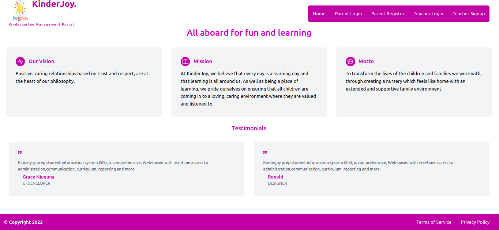
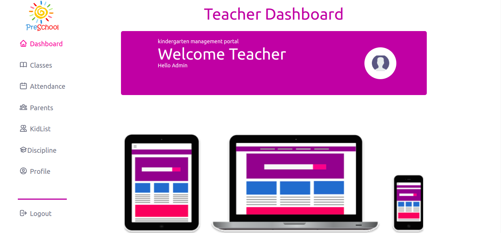
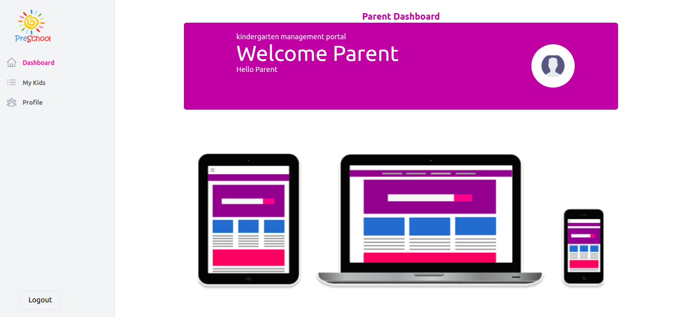

# Kindergarten Management System
### Overview
This project is a fullstack application for managing a kindergarten. It includes two dashboards: an admin dashboard and a parent dashboard. The application allows for the management of students, teachers, and parents, as well as tracking attendance.

# Getting Started
## Tecnologies used
<ol>
<li>Reactjs</li>
<li>Ruby on Rails</li>
<li>AWS Deployment</li>
</ol>
## Prerequisites

Ensure you have ruby version(2.7.4, 3.0.2)  and Nodejs installed in your machine(pc,laptop)

Run: npm install to install all the dependencies.

### Installation
Clone the repository:
```html
 git clone https://github.com/Gracelaura/kindergarten-management-system-frontend.git
```
## Frontend

 Install the dependencies 
 ```html
 npm install
 ```
starting react server
```htm
 npm start
```
## Backend
installing ruby gems
```html
Bundle install
```
Run the command below to run pending migrations and seed data
```html
Rails db:migrate db:reset
```
Starting up the server

```html
Rails s
```

4.The application will be available at http://localhost:4000
### Usage
1. Create an admin account by signing up on the login page.

2. Use the admin dashboard to manage students and teachers.

3. Use the parent dashboard to view attendance and reports for their child.
### Features
- Student management (add, edit, delete)

- Teacher management (add, edit, delete)

- Attendance tracking

### Contributers
1. [Grace Njuguna](https://mail.google.com/mail/u/0/?fs=1&tf=cm&source=mailto&to=grace.njuguna@student.moringaschool.com)

2. [Nicholas Njeru](https://mail.google.com/mail/u/0/?fs=1&tf=cm&source=mailto&to=ronaldcheruyiot342gmail.com)

3. [Ronald Kipchirhir](https://www.linkedin.com/in/ronald-kipchirchir-034983246/)

4. [Timothy Kibet](https://mail.google.com/mail/u/0/?fs=1&tf=cm&source=mailto&to=timothy.kibet@student.moringashool.com)

5. [Ivan Nguyo](https://mail.google.com/mail/u/0/?fs=1&tf=cm&source=mailto&to=nguyoivan@gmail.com)

6. [Geofry Nyakundi](https://mail.google.com/mail/u/0/?fs=1&tf=cm&source=mailto&to=geofry.nyakundi@student.moringashool.com)

7. [Muriithi Kibata](https://mail.google.com/mail/u/0/?fs=1&tf=cm&source=mailto&to=muriithi.kibata@student.moringaschool.com)

# Links to repositories
- [Frontend](https://github.com/Gracelaura/kindergarten-management-system-frontend)

- [Backend](https://github.com/Gracelaura/kindergarten-management-system-frontend)
## Technologies and Tools 
- HTML - to structure our forms
- React - for Client side rendering and routing
- Rails - for developing backend API
- Custom API
- Tailwind CSS and custom css - for styling our application.
- JWT for authenticating users.
- Railway or AWS for hosting the server.
- Netlifly for client hosting.


## MVPS
1. Authentication – login /sign up page. 
2. Landing page.
3. Admin(teacher) and Parents Dashboard.
4. Student details card.
5. Attendance
6. Disciplinary cases
## User Stories
 <li>A teacher gets logged in as an admin while a parent loins as a normal user.</li>
<li>A Landing page that displays a welcome message.</li>
<li>A page that displays a teacher’s dashboard.</li>
<li>A Page that displays a parent’s dashboard.</li>
<li>The option for a teacher to add or delete a new student including the parent’s contact information.</li>
<li>The option for a teacher to view a student’s  information.</li>
<li>The option for a teacher to promote a student to the next class.</li>
<li>The option for a teacher take attendance and view attendance.</li>
<li>The option for a parent to view their child’s attendance and discipline.</li>

## How it works
<p>After a successful launch, the user is redirected to a home page</p>


<p>From homepage a user will have to login either as a teacher or a parent.</p>

<p>Upon a successful Login, You will be redirected to admin dashboard logged in as a teacher</p>  <p>or to parent's dashboard logged in as a parent.</p>

<p>From there a teacher is able to track attendence of a kid, view a list of classes, view names of the parents, view students discipline and also his/her profile</p>
<p>A parent is able to view kidlist, his/her own kid displinary issues and also his/her own profile.</p>

# Support or Contribution

Want to contribute? Great!

For any suggestions or contributions please do not hesitate to contact the owners of this repository.

Contributions to this project are welcomed by all, If you need to contribute 
please  contact us send your github profile to be allowed access.

 
  * Fork the repo
  * Create a new branch (git checkout -b improve-feature)
  * Make the appropriate changes in the files
  * Add changes to reflect the changes made
  * Commit your changes (git commit -am 'Improve feature')
  * Push to the branch (git push origin improve-feature)
  * Create a Pull Request

-Note when making contributions, please endeavour to follow good coding practice.

# License
MIT License

```html
Permission is hereby granted, free of charge, to any person obtaining a copy of this software and associated documentation files (the "Software"), to deal in the Software without restriction, including without limitation the rights to use, copy, modify, merge, publish, distribute, sublicense, and/or sell copies of the Software, and to permit persons to whom the Software is furnished to do so, subject to the following conditions:

The above copyright notice and this permission notice shall be included in all copies or substantial portions of the Software.

THE SOFTWARE IS PROVIDED "AS IS", WITHOUT WARRANTY OF ANY KIND, EXPRESS OR IMPLIED, INCLUDING BUT NOT LIMITED TO THE WARRANTIES OF MERCHANTABILITY, FITNESS FOR A PARTICULAR PURPOSE AND NONINFRINGEMENT. IN NO EVENT SHALL THE AUTHORS OR COPYRIGHT HOLDERS BE LIABLE FOR ANY CLAIM, DAMAGES OR OTHER LIABILITY, WHETHER IN AN ACTION OF CONTRACT, TORT OR OTHERWISE, ARISING FROM, OUT OF OR IN CONNECTION WITH THE SOFTWARE OR THE USE OR OTHER DEALINGS IN THE SOFTWARE.</p>
```
[Go Back to the Top](https://github.com/Gracelaura/kindergarten-management-system-frontend)
## Acknowledgements

We would like to express our heartfelt gratitude to [Daniel Karanja](https://mail.google.com/mail/u/0/?fs=1&tf=cm&source=mailto&to=daniel.karanja@moringaschool.com)                                                                                                                                                                                                , for his invaluable guidance and support throughout this project. His insights and expertise were instrumental in ensuring the success of this endeavor. We also want to thank thim for his constant follow-ups and encouragement, which helped us stay on track and motivated. We are deeply grateful to have had the opportunity to work with him. Thank you, [Daniel Karanja!](https://mail.google.com/mail/u/0/?fs=1&tf=cm&source=mailto&to=daniel.karanja@moringaschool.com)

# Others
<p > <span>Live Backend Link </span><span className="text-pink-600">http://35.172.230.181:3000</span></p>
<p > <span>Frontend Deployment </span><span className="text-pink-600">http://35.172.230.181:4000</span></p>

[Go Back to the Top](https://github.com/Gracelaura/kindergarten-management-system-frontend)

